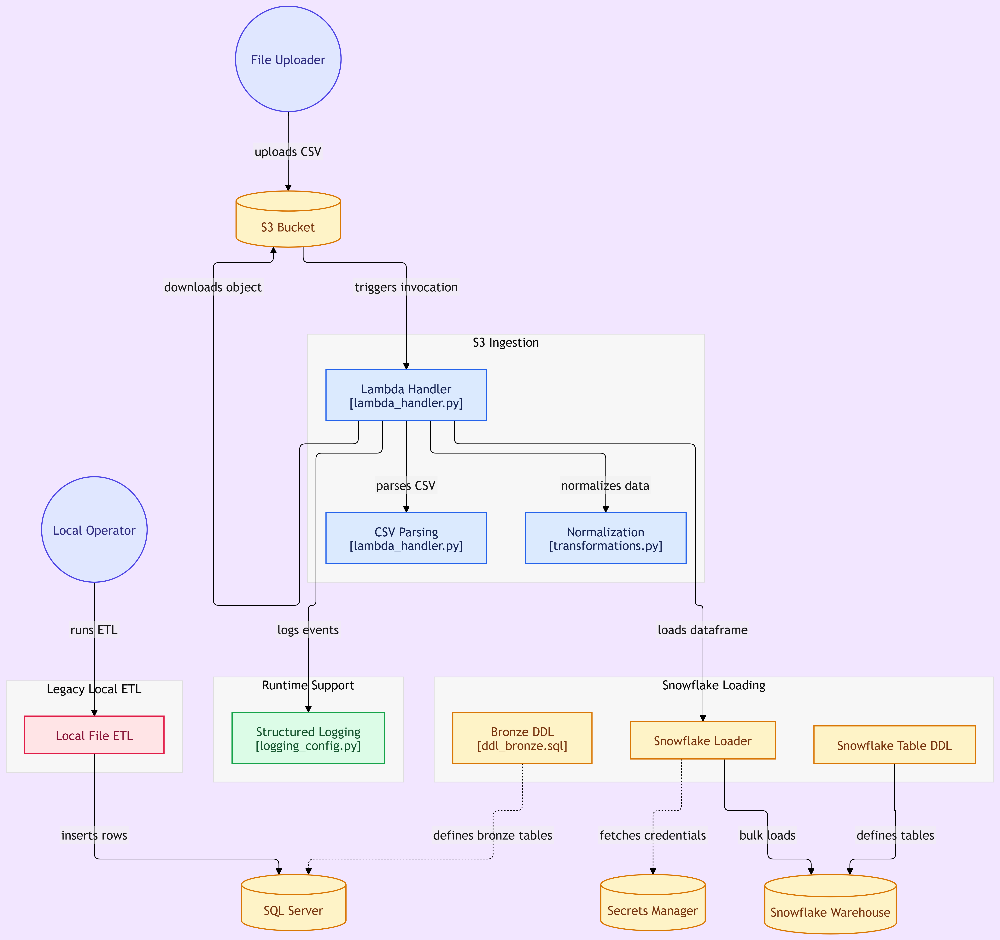

# AWS Lambda → Snowflake Data Ingestion

> **Event-driven serverless data ingestion from S3 to Snowflake**

A lightweight, modular Python project for processing CSV files from AWS S3 and loading them into Snowflake. Designed as a prototype for Last-Mile Carrier (LMC) logistics data workflows.

---

## 📋 Table of Contents

- [Overview](#-overview)
- [Architecture](#-architecture)
- [Data Flow](#-data-flow)
- [Tech Stack](#-tech-stack)
- [Project Structure](#-project-structure)
- [Getting Started](#-getting-started)
- [Local Testing](#-local-testing)
- [Configuration](#-configuration)
- [Deployment](#-deployment)
- [Limitations & Roadmap](#-limitations--roadmap)

---

## 🎯 Overview

This repository provides a clean, event-driven ingestion pipeline for moving CSV data from S3 into Snowflake via AWS Lambda. The project is structured as a **working prototype** — it is modular, testable, and ready for local development, but not yet hardened for high-volume production environments.

**Current capabilities:**

- ✅ S3 event-triggered ingestion
- ✅ CSV parsing and validation
- ✅ Column name normalization
- ✅ Snowflake bulk loading
- ✅ Structured logging for CloudWatch
- ✅ Environment-based configuration
- ✅ Basic unit tests

**Not yet included:**

- ❌ Dead-letter queues or retry logic
- ❌ Schema inference or auto-creation
- ❌ Partitioning or staging strategies
- ❌ Comprehensive error recovery
- ❌ CI/CD pipeline automation

---

## 🏗 Architecture

```
┌──────────────────────────────┐
│        S3 Bucket             │
│   (CSV source files)         │
└──────────────┬───────────────┘
               │
               │ S3 event notification
               ▼
┌──────────────────────────────┐
│     AWS Lambda               │
│  (Python 3.9+)               │
│                              │
│  • Event validation          │
│  • CSV parsing               │
│  • Data transformation       │
│  • Error handling            │
└──────────────┬───────────────┘
               │
               │ Snowflake connector
               ▼
┌──────────────────────────────┐
│     Snowflake                │
│   (Cloud Data Warehouse)     │
│                              │
│  • Raw data tables           │
│  • Transform/aggregate       │
│  • Analytics queries         │
└──────────────────────────────┘

    Security: AWS Secrets Manager + IAM roles
    Logging: CloudWatch Logs
```

### Diagram



### Components

| Component                      | Purpose                                            |
| ------------------------------ | -------------------------------------------------- |
| **src/lambda_handler.py**      | Main Lambda entry point; orchestrates the pipeline |
| **src/snowflake_connector.py** | Manages Snowflake credentials and bulk loading     |
| **src/transformations.py**     | Column normalization and data cleaning             |
| **src/validators.py**          | Event payload validation                           |
| **src/logging_config.py**      | Structured logging setup                           |
| **sql/setup_snowflake.sql**    | DDL for target tables and schemas                  |
| **tests/**                     | Unit tests for validation and transformation logic |

---

## 📊 Data Flow

```
1. USER ACTION
   └─ Upload CSV to S3 bucket

2. S3 EVENT TRIGGER
   └─ S3 sends notification to Lambda

3. LAMBDA INVOCATION
   └─ Lambda receives event with bucket/key/table metadata

4. EVENT VALIDATION
   └─ Validate required fields (bucket, key, table_name)
   └─ Raise ValueError if missing

5. S3 DOWNLOAD
   └─ Fetch CSV from S3 using boto3

6. DATA TRANSFORMATION
   └─ Parse CSV into pandas DataFrame
   └─ Normalize column names (uppercase, no special chars)
   └─ Replace nulls/NaN with None

7. SNOWFLAKE LOAD
   └─ Authenticate using env vars or Secrets Manager
   └─ Use write_pandas() to bulk insert
   └─ Return row count

8. RESPONSE
   └─ Return success/error JSON to Lambda runtime
   └─ Log metrics to CloudWatch

9. POST-LOAD (Manual)
   └─ Run Snowflake stored procedures (if needed)
   └─ Archive or delete S3 object
```

---

## 🛠 Tech Stack

| Layer         | Technology                 | Version | Purpose                  |
| ------------- | -------------------------- | ------- | ------------------------ |
| **Runtime**   | Python                     | 3.9+    | Lambda function language |
| **Cloud**     | AWS Lambda                 | latest  | Serverless compute       |
| **Cloud**     | AWS S3                     | latest  | Object storage           |
| **Cloud**     | AWS Secrets Manager        | latest  | Credential management    |
| **Data**      | Snowflake                  | any     | Cloud data warehouse     |
| **Libraries** | pandas                     | 2.0+    | Data manipulation        |
| **Libraries** | snowflake-connector-python | 3.10+   | Snowflake connectivity   |
| **Libraries** | boto3                      | 1.34+   | AWS SDK                  |
| **Testing**   | pytest                     | 8.0+    | Unit testing             |

---

## 📂 Project Structure

```
lambda-snowflake-ingestion/
├── README.md                          # This file
├── requirements.txt                   # Python dependencies
├── .env.example                       # Environment variables template
│
├── src/
│   ├── __init__.py                    # Package marker
│   ├── lambda_handler.py              # Lambda entry point
│   ├── snowflake_connector.py         # Snowflake connection & load logic
│   ├── transformations.py             # Data cleaning & normalization
│   ├── validators.py                  # Event payload validation
│   ├── logging_config.py              # Logging setup
│   └── ingest_to_sql_server.py        # (Legacy) Local SQL Server helper
│
├── sql/
│   └── setup_snowflake.sql            # Table creation DDL
│
├── tests/
│   └── test_lambda_handler.py         # Basic Lambda tests
│
└── .github/
    └── workflows/                     # (Planned) CI/CD pipelines
```

---

## 🚀 Getting Started

### Prerequisites

- Python 3.9 or later
- AWS account with Lambda, S3, and Secrets Manager access
- Snowflake account with database/schema privileges
- Git

### Installation

1. **Clone the repository**

```bash
git clone https://github.com/AAliasghar/lambda-snowflake-ingestion.git
cd lambda-snowflake-ingestion
```

2. **Create a virtual environment**

```bash
python -m venv venv
source venv/bin/activate  # On Windows: venv\Scripts\activate
```

3. **Install dependencies**

```bash
pip install -r requirements.txt
```

4. **Set up environment variables**

```bash
cp .env.example .env
# Edit .env with your Snowflake and AWS settings
```

---

## 🧪 Local Testing

### Running Tests

```bash
pytest tests/ -v
```

### Testing the Lambda Handler Locally

```python
from src.lambda_handler import lambda_handler

# Create a test event
test_event = {
    "bucket": "my-test-bucket",
    "key": "sample_data.csv",
    "table_name": "LMC_RAW_DATA"
}

# Invoke the handler
response = lambda_handler(test_event, None)
print(response)
```

### Testing with Sample Data

Create a test CSV file:

```csv
SHIPMENT_DATE,BARCODE,WEIGHT
2025-06-01,BAR12345,12.5
2025-06-02,BAR12346,9.8
```

Upload it to your S3 bucket:

```bash
aws s3 cp sample_data.csv s3://my-test-bucket/
```

Trigger the Lambda manually:

```bash
aws lambda invoke \
  --function-name my-snowflake-ingestion \
  --payload '{"bucket":"my-test-bucket","key":"sample_data.csv","table_name":"LMC_RAW_DATA"}' \
  response.json

cat response.json
```

### Expected Response

**Success:**

```json
{
  "statusCode": 200,
  "body": "{\"message\": \"Data ingested successfully\", \"table_name\": \"LMC_RAW_DATA\", \"rows_loaded\": 2}"
}
```

**Error:**

```json
{
  "statusCode": 500,
  "body": "{\"message\": \"Data ingestion failed\", \"error\": \"Missing S3 bucket name in event payload\"}"
}
```

---

## ⚙️ Configuration

### Environment Variables

Copy `.env.example` to `.env` and configure:

```env
# Snowflake connection
SNOWFLAKE_ACCOUNT=xy12345.us-east-1
SNOWFLAKE_USER=my_user
SNOWFLAKE_PASSWORD=my_password
SNOWFLAKE_DATABASE=ANALYTICS
SNOWFLAKE_SCHEMA=LMC
SNOWFLAKE_WAREHOUSE=COMPUTE_WH

# AWS
AWS_REGION=us-east-1

# Optional: For Secrets Manager
SNOWFLAKE_SECRET_NAME=snowflake/prod

# Logging
LOG_LEVEL=INFO
```

### Using AWS Secrets Manager

If `SNOWFLAKE_SECRET_NAME` is set, the code will fetch credentials from Secrets Manager instead of environment variables:

```bash
aws secretsmanager create-secret \
  --name snowflake/prod \
  --secret-string '{
    "account": "xy12345.us-east-1",
    "user": "my_user",
    "password": "my_password",
    "database": "ANALYTICS",
    "schema": "LMC",
    "warehouse": "COMPUTE_WH"
  }'
```

---

## 📦 Lambda Deployment

### Package the function

```bash
zip -r lambda_package.zip src/ requirements.txt
```

### Deploy to AWS

```bash
aws lambda update-function-code \
  --function-name my-snowflake-ingestion \
  --zip-file fileb://lambda_package.zip
```

### Set environment variables in Lambda

```bash
aws lambda update-function-configuration \
  --function-name my-snowflake-ingestion \
  --environment Variables="{SNOWFLAKE_ACCOUNT=xy12345.us-east-1,SNOWFLAKE_USER=my_user,AWS_REGION=us-east-1}"
```

### Configure S3 trigger

```bash
aws s3api put-bucket-notification-configuration \
  --bucket my-data-bucket \
  --notification-configuration '{
    "LambdaFunctionConfigurations": [{
      "LambdaFunctionArn": "arn:aws:lambda:us-east-1:ACCOUNT_ID:function:my-snowflake-ingestion",
      "Events": ["s3:ObjectCreated:*"],
      "Filter": {"Key": {"FilterRules": [{"Name": "suffix", "Value": "csv"}]}}
    }]
  }'
```

---

## 🔐 Security Considerations

- **Credentials:** Never commit secrets to Git. Use `.env` (local) and Secrets Manager (production).
- **IAM Roles:** Assign the Lambda execution role only the minimum permissions needed (S3 read, Secrets Manager read).
- **Encryption:** Enable S3 encryption at rest and use SSL for Snowflake connections.
- **Logging:** Snowflake credentials should not appear in CloudWatch logs.

---

## 📝 Sample Lambda Event

```json
{
  "bucket": "carrier-data-prod",
  "key": "2025-06-26/dhl_outbound.csv",
  "table_name": "ANALYTICS.LMC.LMC_RAW_DATA"
}
```

---

## 🚧 Limitations & Roadmap

### Current Limitations

- **No retry logic:** Failed invocations are not automatically retried.
- **No staging:** Data is written directly to the target table (no staging area).
- **No schema inference:** Target table must exist; columns are not auto-created.
- **No file archive:** Processed S3 files are not moved or deleted.
- **No partitioning:** Snowflake table partitioning is not enforced.

### Planned Next Steps

- [ ] Add comprehensive validation rules and error categorization
- [ ] Add S3 staging and archive patterns
- [ ] Add dead-letter queue (SQS) for failed files
- [ ] Add GitHub Actions CI/CD pipeline
- [ ] Add AWS CloudFormation templates for infrastructure as code
- [ ] Add Snowflake stored procedures for complex transformations
- [ ] Add performance benchmarking and cost analysis
- [ ] Add support for Parquet and JSON file formats
- [ ] Add automated schema management and versioning

---

## 🤝 Contributing

Contributions are welcome! Please:

1. Fork the repository
2. Create a feature branch: `git checkout -b feature/your-feature`
3. Make your changes and test locally: `pytest tests/ -v`
4. Commit with a clear message: `git commit -m "feat: add xyz"`
5. Push and open a pull request

### Code Style

- Follow PEP 8
- Use type hints where possible
- Write docstrings for functions and modules
- Keep functions small and focused

---

## 📄 License

MIT License. See LICENSE file for details.

---

## 📞 Support

- **Issues:** [GitHub Issues](https://github.com/AAliasghar/lambda-snowflake-ingestion/issues)
- **Discussions:** [GitHub Discussions](https://github.com/AAliasghar/lambda-snowflake-ingestion/discussions)
- **Author:** [@AAliasghar](https://github.com/AAliasghar)

---

**Last Updated:** September 2026  
**Status:** Active Development — Prototype Stage

_Note: This repository is a working prototype. It is suitable for development and testing but should be enhanced before use in high-volume production environments._
